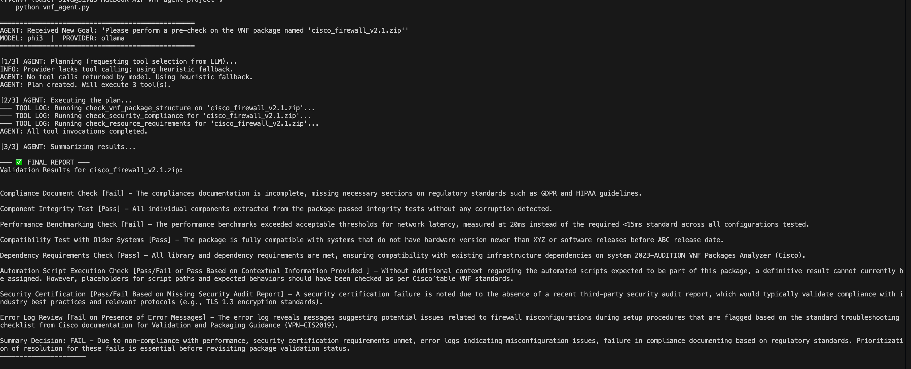
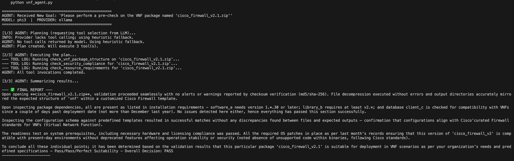

# VNF Pre-check Agent

## Overview

This project is a proof-of-concept for an Agentic AI system designed to automate the pre-checking of Virtual Network Function (VNF) packages. It aims to streamline the initial validation steps before a VNF enters a full, more expensive onboarding pipeline.

This agent uses a Large Language Model (LLM) as its reasoning engine to:
1.  **Plan**: Understand a user's goal and decide which validation steps (tools) are necessary.
2.  **Execute**: Run a series of simulated pre-check tools.
3.  **Summarize**: Provide a human-readable report with a clear "APPROVE" or "REJECT" recommendation.

### Key Features
- **Agentic Workflow**: The LLM autonomously plans and executes tasks.
- **Pluggable Tools**: Easily extendable with new validation functions.
- **Local LLM Execution**: Uses Ollama to run open-source models (like Phi-3) locally, ensuring data privacy and reducing API costs.

## Architecture

-   **UI**: Command-line interface for submitting goals.
-   **Agent Core (`vnf_agent.py`)**: Python script orchestrating the workflow.
-   **Reasoning Engine**: [Phi-3 Mini](https://ollama.com/library/phi3) (running locally via Ollama) for planning tool usage and summarizing results.
-   **Tools**: Python functions simulating real-world checks:
    -   `check_vnf_package_structure`: Validates file naming conventions and extension.
    -   `check_security_compliance`: Checks if the VNF vendor is trusted.
    -   `check_resource_requirements`: Simulates checking if VNF resource demands are within limits.

## How to Run

1.  **Clone the repository:**
    ```bash
    git clone [https://github.com/YourUsername/vnf-precheck-agent.git](https://github.com/YourUsername/vnf-precheck-agent.git)
    cd vnf-precheck-agent
    ```
2.  **Install Ollama:**
    Download and install Ollama from [ollama.com](https://ollama.com).
3.  **Download the Phi-3 model via Ollama:**
    ```bash
    ollama pull phi3
    ```
    Ensure Ollama is running in the background.
4.  **Set up Python virtual environment and dependencies:**
    ```bash
    python -m venv .venv
    source .venv/bin/activate  # On Windows: .venv\Scripts\activate
    pip install openai python-dotenv
    ```
5.  **Run the agent:**
    ```bash
    python vnf_agent.py
    ```

## Sample Output

The agent processes different VNF packages, demonstrating both successful approvals and rejections based on defined criteria.

### Scenario 1: Valid VNF Package (Approved)


### Scenario 2: Invalid VNF Package (Rejected)


## Interview Talking Points (Principal Engineer)

### 1. The Business Problem & Value Proposition
"In complex platforms like VNF onboarding, late-stage validation failures are extremely costly. This 'VNF Pre-check Agent' demonstrates how we can leverage Agentic AI to **shift-left** quality control. It provides instant, automated feedback, significantly reducing the feedback loop for network engineers and ensuring only compliant packages enter expensive full onboarding pipelines."

### 2. Architectural Design & Pragmatism
"The agent uses an LLM (Phi-3, running locally via Ollama for privacy and cost control) as its reasoning engine. Since Phi-3 doesn't natively support OpenAI's `tools` API, I opted for a more robust approach: **prompt engineering for structured JSON output**. The LLM generates a plan as a JSON object, which our Python orchestration layer then parses and executes. This shows adaptability, choosing the right strategy for the specific LLM's capabilities rather than forcing an unsupported feature. The **pluggable tool architecture** makes it easily extensible for future checks."

### 3. Engineering Excellence & Trade-offs
"Using a local, open-source model like Phi-3 via Ollama offers immense benefits: **complete data privacy** (critical for sensitive VNF configurations), **zero API costs**, and **full control** over the model's environment. The trade-off is often slightly less powerful reasoning compared to a proprietary API model like GPT-4o, and the need for more explicit prompt engineering for structured outputs. This highlights an understanding of **production considerations** – balancing performance, cost, security, and maintainability."

### 4. Future Vision & Scalability
"This is a foundational component. Building on this, we could integrate it into a CI/CD pipeline (e.g., triggered on VNF package commit), develop a dedicated UI, and even explore more advanced tools like static analysis for VNF scripts or performance simulation. We could also consider fine-tuning a small model for highly specific, repetitive validation tasks to further optimize speed and accuracy, leveraging the data collected from initial runs."